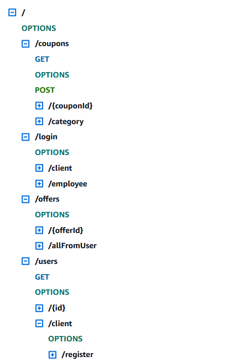

# La Cuponera - AWS SAM Architecture

Serverless Architecture Modeol for La Cuponera, a fictional enterprise for managing coupons and discounts.
This whole project is meant to be deployed and integrated into the AWS ApiGateway service, alongside with 
AWS Lambda for functionality computing and DynamoDB for entity storage.

## CDK Usage

For deploying the proyect, simply compile the programs inside `lambda/functions/*` and zip them into a 
.zip file. This generates the asset for the Lambda function.
The whole infrastructure is defined using the AWS CDK for Go, just for convenience in the deployment.

## Endpoints

For a full list of endpoints, refer to the AWS ApiGateway documentation. The hierarchy looks something like 
the following:

### Requisites

For building this project, the following programs and their specific versions were used:
- Go (1.23.6)
- AWS CDK (2.178.1)
- Operating System: Windows (Linux for Lambda binaries)

### TODOS
- [x] Protect the route for querying all user's offers
- [x] Coupon category system, for easy querying
- [x] Fix the category system: include both the enterprise ID and the coupon category in the same entity
- [x] More descriptive error code when a user does not exist
- [ ] Employee registration and login system